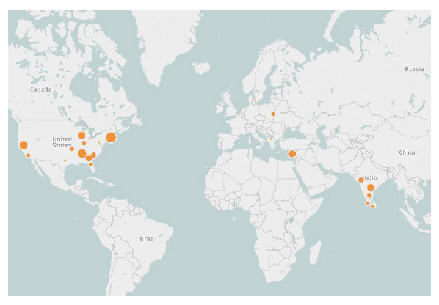

## The Better eXperience Research Project

BetterX is a research project from the University of Central Lancashire partly sponsored by Amazon Web Services.  The aim of BetterX is to explore ways to measure, model and enhance the Quality of Experience (QoE) of mobile web users in a practical manner applicable to real-world settings.

### Research Questions
1. What are the Design & Techical Considerations of an end-to-end system to measure and enhance the Mobile Web Quality of Experience (MWQoE) in a non-instrusive manner?
2. What factors affect MWQoE and how do they affect it?
3. What are the real-world scenarios in which we can predict and enhance MWQoE with reasonable confidence?

### MWQoE Mobile-to-Cloud Solution

The [BetterX Android app](https://github.com/eliasall/BetterX-Android) collects anonymous information about the mobile device, the network, the connection, and sensor readings of the user's surrounding environment.  The [BetterX Firefox addon](https://github.com/eliasall/BetterX-Firefox) collects anonymous web browsing information and the [BetterX Cloud](https://github.com/eliasall/BetterX-Cloud) is used as the processing hub of all the information that is collected and produces the Mobile Web Quality of Experience (MWQoE) model and the MWQoE metric on a 1-5 scale.

## Phase 1
The first phase of BetterX is to collect live mobile user data and construct a predictive model which quantifies (or scores) the user-perceived experience of mobile web browsing sessions.  For that, three components were developed, the BetterX Android Application, the BetterX Cloud Setup and the BetterX Firefox Addon.

The first phase of BetterX has been completed and a proof-of-concept implementation of a Mobile-to-Cloud system which measures, predicts and attempts to enhance the Mobile Web Quality of Experience has been developed.  Moreover, the first version of the MWQoE model has been generated based on a live data collection ([BetterX Dataset](https://github.com/eliasall/BetterX-Dataset)) from all over the world.  The MWQoE model has been evaluated and benchmarked against actual user responses from a lab experiment in which selected web sessions which were observed in the live dataset have been simulated in a lab environment.

### Phase 1 Stats

Stat | Records
------------ | -------------
Mobile Web Sessions Observed | 2727
HTTP Requests Measured | 58515
Domains | 165
Total Readings | 1,371,500

### The MWQoE Model

Stat | Records
------------ | -------------
User Profiles Identified | 4
Domain Types | 27
Location Types | 7

The BetterX project shows that the Mobile Web Quality of Experience evaluation and prediction in using a non-intrusive approach is possible and that the MWQoE model can be used in real-world scenarios to characterize the user’s satisfiability in mobile web browsing.

_Publications and more information about BetterX will be posted here soon._

### Contact Team
Elias Allayiotis [EAllayiotis [at] uclan.ac.uk](mailto:EAllayiotis [~at~] uclan.ac.uk)

Josephina Antoniou [JAntoniou [at] uclan.ac.uk](mailto:JAntoniou [~at~] uclan.ac.uk)

### Next Steps
Currently, the second phase of BetterX is being planned to implement enhancements on the generated model and improve accuracy.

Anyone interested in this project can download/modify/contribute to the source code that is made available and also use/analyze the published datasets.  The BetterX project is licenced under the Apache License, Version 2.0

### License
_Copyright 2017 Elias Allayiotis_

_Licensed under the Apache License, Version 2.0 (the "License"); you may not use this file except in compliance with the License. You may obtain a copy of the License at http://www.apache.org/licenses/LICENSE-2.0_

_Unless required by applicable law or agreed to in writing, software distributed under the License is distributed on an "AS IS" BASIS, WITHOUT WARRANTIES OR CONDITIONS OF ANY KIND, either express or implied. See the License for the specific language governing permissions and limitations under the License._
